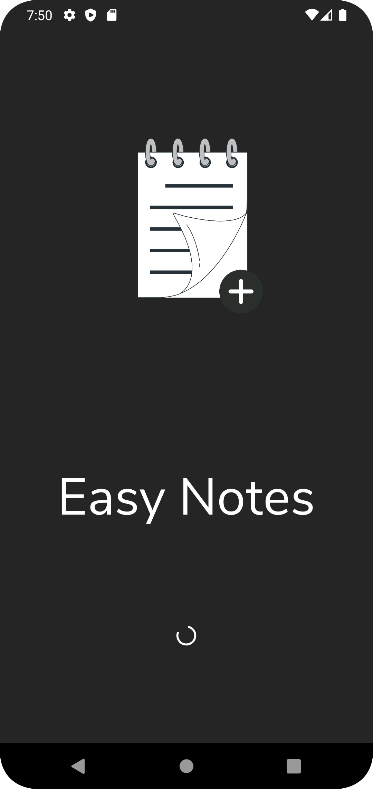
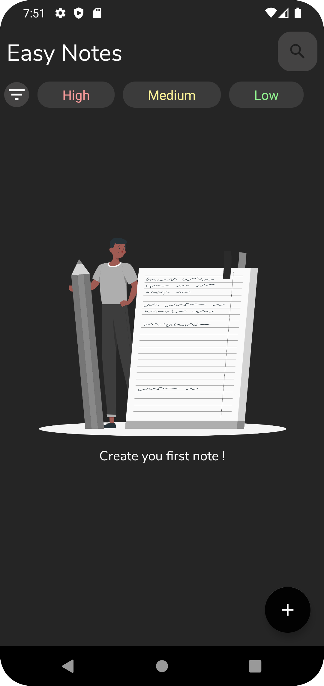
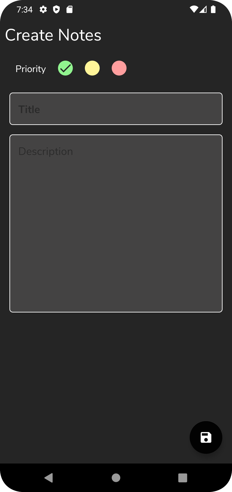
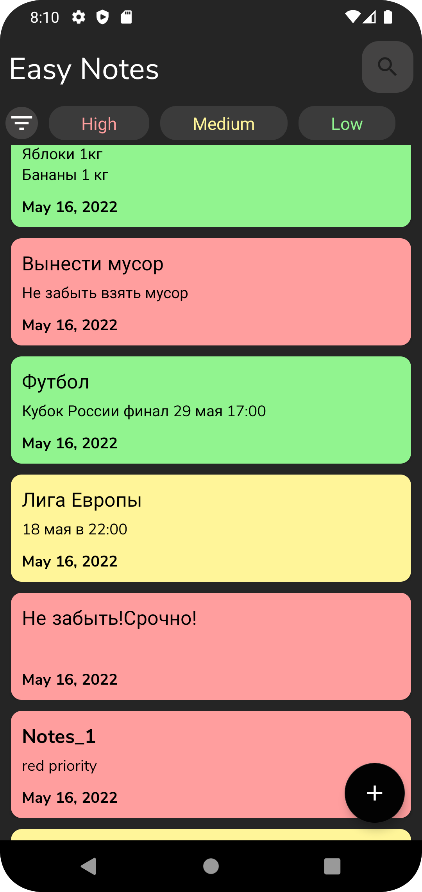
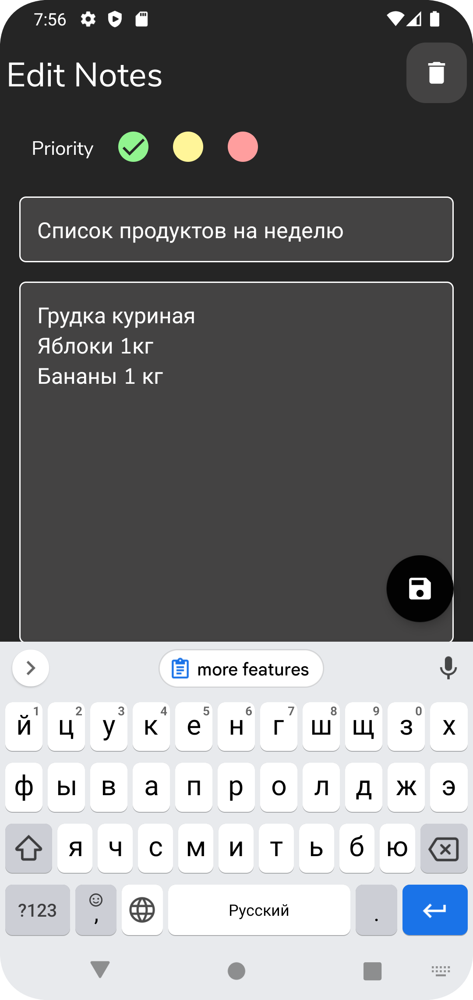
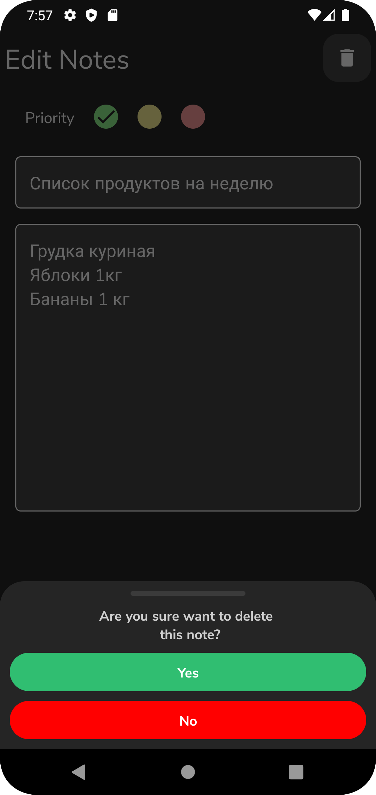
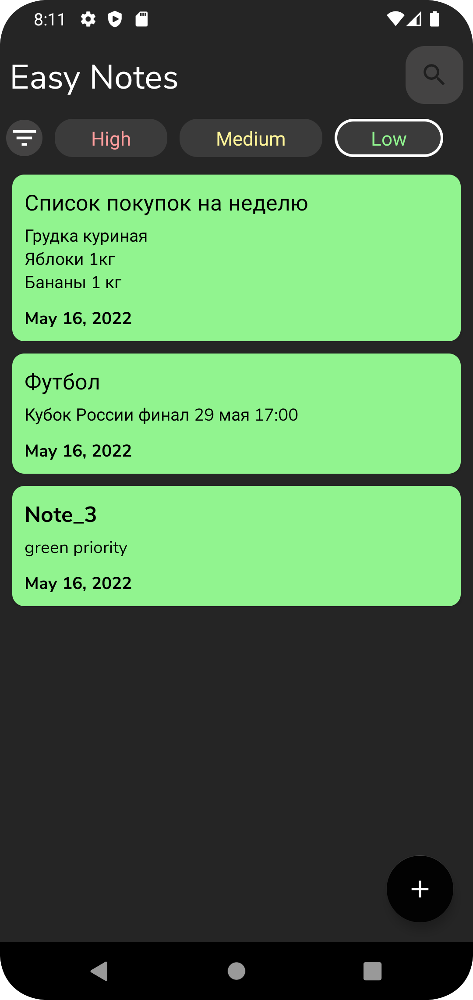
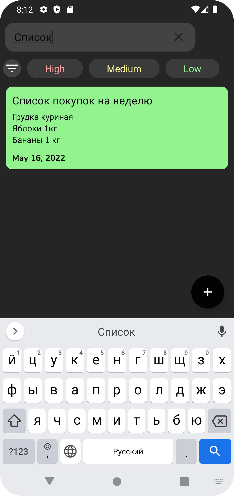
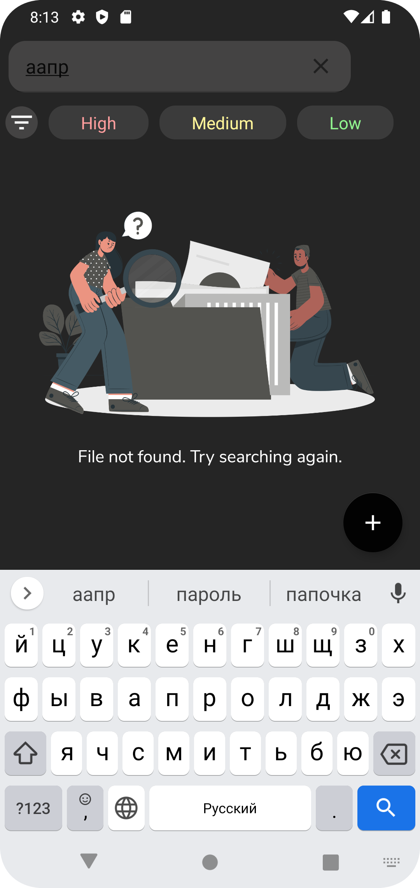

# EasyNotes
| Splash Activity  | Empty list notes  | Add new note  |
| ---------------------------------------------- | -------------------------------------------- | ------------------------------------------- |
| List Notes  | Edit note  | Delete notes  |
| Sorting low priority  | Search note  | Search "Not found"  |
